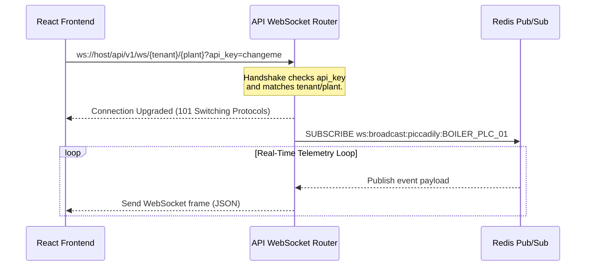

# Piccadily Industrial Historian v4.0 — API & Frontend Integration Guide

This specialized guide provides front-end and full-stack engineers with a definitive blueprint for seamlessly connecting user interfaces, scripts, and analytical tools to the **Piccadily Industrial Historian** backend APIs and WebSocket streams.

---

## 1. Single-Container Relative Architecture

By packaging both the React/Vite frontend and FastAPI backend into a single container, the application operates under a **single-origin model** at runtime (typically port `80` or `443` behind Nginx).

### Why this is a game-changer:
1. **Zero CORS Policy Issues**: Since the frontend bundle and backend APIs share the exact same host and protocol, browsers automatically authorize requests without needing pre-flight `OPTIONS` requests or explicit CORS origin lists.
2. **Environment Zero-Config**: You do not need to hardcode `http://localhost:8000` or maintain separate `.env` files for staging, dev, and production. The browser automatically targets the active host.
3. **Implicit Protocol Matching**: WebSocket endpoints can dynamically resolve their protocol (`ws://` vs `wss://`) depending on whether the page is loaded over HTTP or secure HTTPS.

---

## 2. Authentication Contract

The backend uses a dual-auth system allowing standard users to authenticate via Supabase JWTs, and edge agents or internal systems to connect using static API Keys.

### REST Endpoint Auth
REST requests must provide authentication credentials in the headers.

```http
# Option A: API Key Auth
X-API-Key: changeme

# Option B: Supabase JWT Auth
Authorization: Bearer <your_supabase_jwt_token>
```

### WebSocket Handshake Auth
WebSockets do not natively support custom headers during the initial browser handshake (`new WebSocket()`). Therefore, authentication credentials **must** be injected as query parameters in the connection URL.

```javascript
// Example Connection URLs
const wsUrlWithApiKey = `ws://${window.location.host}/api/v1/ws/piccadily/BOILER_PLC_01?api_key=changeme`;
const wsUrlWithToken  = `ws://${window.location.host}/api/v1/ws/piccadily/BOILER_PLC_01?token=<jwt_token>`;
```

---

## 3. REST API Contract Reference

All endpoints return JSON responses. If standard requests fail, expect `400 (Bad Request)`, `401 (Unauthorized)`, or `403 (Forbidden)`.

### 3.1 Tag Metadata
Retrieve tag names, descriptions, engineering units, groups, and alarm thresholds configured for a specific plant.

* **Endpoint**: `GET /api/v1/tags`
* **Query Parameters**:
  * `plant_id` (string, required): The target plant ID (e.g., `BOILER_PLC_01`).
* **Headers**: `X-API-Key: changeme`
* **Response Payload (`200 OK`)**:
```json
[
  {
    "tenant_id": "piccadily",
    "plant_id": "BOILER_PLC_01",
    "tag_name": "TT-201",
    "description": "Steam Temp Main Line",
    "engineering_unit": "°C",
    "opc_node_id": "ns=2;s=Source.Boiler.TT201",
    "data_type": "Float64",
    "tag_group": "temperature",
    "low_low_limit": 100.0,
    "low_limit": 150.0,
    "high_limit": 480.0,
    "high_high_limit": 520.0,
    "deadband": 2.0,
    "is_active": true
  }
]
```

---

### 3.2 Telemetry Historical Queries
Fetch historical time-series data for a specific tag. The system will dynamically direct the query to the correct **per-group hypertable** using the internal `TagRouter` and apply automatic downsampling if a resolution is requested.

* **Endpoint**: `GET /api/v1/telemetry/history`
* **Query Parameters**:
  * `plant_id` (string, required): e.g., `BOILER_PLC_01`.
  * `tag_name` (string, required): e.g., `TT-201`.
  * `start_ts` (ISO-8601 string, optional): ISO Start timestamp.
  * `end_ts` (ISO-8601 string, optional): ISO End timestamp.
  * `resolution` (string, optional): Downsample resolution (`1min`, `5min`, `1hour`, `1day`).
* **Response Payload (`200 OK`)**:
```json
{
  "plant_id": "BOILER_PLC_01",
  "tag_name": "TT-201",
  "source_table": "telemetry_temperature",
  "resolution": "5min",
  "data": [
    {
      "ts": "2026-05-20T11:00:00Z",
      "val": 420.5,
      "quality": "GOOD"
    },
    {
      "ts": "2026-05-20T11:05:00Z",
      "val": 421.2,
      "quality": "GOOD"
    }
  ]
}
```

---

### 3.3 Active Alarms
Retrieve currently active alarms that have not been cleared.

* **Endpoint**: `GET /api/v1/alarms/active`
* **Query Parameters**:
  * `plant_id` (string, required): e.g., `BOILER_PLC_01`.
* **Response Payload (`200 OK`)**:
```json
[
  {
    "alarm_id": "3fa85f64-5717-4562-b3fc-2c963f66afa6",
    "tenant_id": "piccadily",
    "plant_id": "BOILER_PLC_01",
    "tag_name": "PT-201",
    "severity": "HIGH",
    "alarm_state": "ACTIVE",
    "message": "Main Steam Line Pressure exceeded High limit (47.0 Kg/cm²)",
    "trigger_value": 48.2,
    "occurred_at": "2026-05-20T11:22:15Z",
    "acked_by": null,
    "acked_at": null
  }
]
```

---

### 3.4 Acknowledge Alarms
Acknowledge an active alarm to signal that operators are addressing the condition.

* **Endpoint**: `POST /api/v1/alarms/ack`
* **Payload Body (`application/json`)**:
```json
{
  "alarm_id": "3fa85f64-5717-4562-b3fc-2c963f66afa6",
  "acked_by": "operator_john"
}
```
* **Response Payload (`200 OK`)**:
```json
{
  "status": "success",
  "message": "Alarm acknowledged",
  "acked_at": "2026-05-20T11:25:30Z"
}
```

---

## 4. Live Stream WebSocket Integration

The real-time streaming layer is backed by **Redis Pub/Sub**. When telemetry is ingested, it is broadcasted to tenant-and-plant-specific channels. Front-end clients subscribe to these channels via a WebSocket interface.

### 4.1 WebSocket Connection Flow



### 4.2 Standard WebSocket Frame Structure
Whenever new telemetry points arrive for your subscribed plant, you will receive a JSON payload detailing the updated values.

```json
{
  "type": "telemetry",
  "timestamp": "2026-05-20T11:32:00Z",
  "data": {
    "TT-201": {
      "v": 420.8,
      "q": "GOOD",
      "t": "2026-05-20T11:32:00Z"
    },
    "PT-201": {
      "v": 42.4,
      "q": "GOOD",
      "t": "2026-05-20T11:32:00Z"
    }
  }
}
```

### 4.3 Alarms Notification Payload
If the alarm engine triggers or modifies an alarm, it pushes a real-time alarm payload directly down the same WebSocket connection:

```json
{
  "type": "alarm",
  "timestamp": "2026-05-20T11:32:05Z",
  "data": {
    "alarm_id": "3fa85f64-5717-4562-b3fc-2c963f66afa6",
    "tag_name": "PT-201",
    "severity": "CRITICAL",
    "alarm_state": "ACTIVE",
    "message": "Steam Drum Pressure exceeded High-High limit (52.0 Kg/cm²)",
    "trigger_value": 52.8
  }
}
```

---

## 5. Front-End Reconnection & Handshake Script Pattern

To ensure your web interface remains robust under unstable edge networks, implement the following **Robust WebSocket Client** pattern in your frontend code (such as in React `useEffect` hooks):

```typescript
import { useState, useEffect } from 'react';

export function useHistorianStream(plantId: string, apiKey: string) {
  const [latestReadings, setLatestReadings] = useState<Record<string, any>>({});
  const [connStatus, setConnStatus] = useState<'connecting' | 'connected' | 'disconnected'>('disconnected');

  useEffect(() => {
    let ws: WebSocket | null = null;
    let reconnectDelay = 1000; // Start with 1 second delay
    const maxReconnectDelay = 30000;
    let timerId: any = null;

    function connect() {
      setConnStatus('connecting');

      // Implicitly match host and secure protocols (ws:// vs wss://)
      const protocol = window.location.protocol === 'https:' ? 'wss:' : 'ws:';
      const wsUrl = `${protocol}//${window.location.host}/api/v1/ws/piccadily/${plantId}?api_key=${apiKey}`;

      ws = new WebSocket(wsUrl);

      ws.onopen = () => {
        setConnStatus('connected');
        reconnectDelay = 1000; // Reset exponential delay on success
        console.log(`Connected to Historian Stream for plant: ${plantId}`);
      };

      ws.onmessage = (event) => {
        try {
          const payload = JSON.parse(event.data);

          if (payload.type === 'telemetry' && payload.data) {
            setLatestReadings((prev) => ({
              ...prev,
              ...payload.data
            }));
          } else if (payload.type === 'alarm') {
            console.warn('Alarm event received!', payload.data);
            // Handle active alarm alert banner or updates here
          }
        } catch (err) {
          console.error("Failed to parse live telemetry stream packet", err);
        }
      };

      ws.onclose = (event) => {
        setConnStatus('disconnected');
        console.warn(`WebSocket closed. Reconnecting in ${reconnectDelay}ms...`, event.reason);

        // Exponential backoff reconnect
        timerId = setTimeout(() => {
          reconnectDelay = Math.min(reconnectDelay * 2, maxReconnectDelay);
          connect();
        }, reconnectDelay);
      };

      ws.onerror = (err) => {
        console.error("WebSocket connection encountered an error: ", err);
        ws?.close();
      };
    }

    connect();

    // Clean up connections on unmount or plantId swap
    return () => {
      if (ws) {
        ws.onclose = null; // Prevent callback firing during deliberate teardown
        ws.close();
      }
      clearTimeout(timerId);
    };
  }, [plantId, apiKey]);

  return { latestReadings, connStatus };
}
```

This ensures that the client interface seamlessly reconnects without operator intervention or resource leaks, providing a premium user experience.
